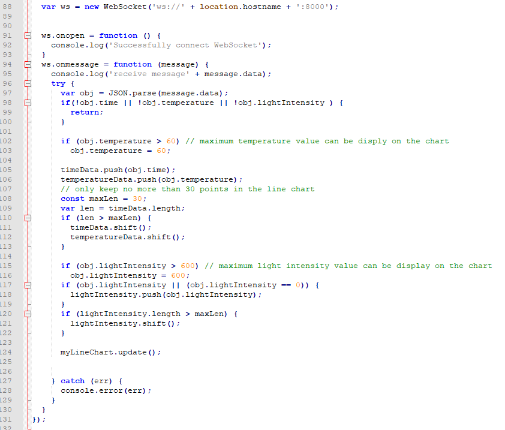

# HTTP Website with WebSocket connection

> "Wireless Made Easy!" - This example application enable a websocket server with the HTTP website, temperature and light intensity value is send to the browser through the websocket connection and display in real time.

Devices: **WFI32E01**

<!--

**Watch the video and see how the temperature and light intensity can be shown on the webpage using websocket server**

-->

## ⚠ Disclaimer

<b>
THE SOFTWARE ARE PROVIDED "AS IS" AND GIVE A PATH FOR SELF-SUPPORT AND SELF-MAINTENANCE.  
This repository contains unsupported example code intended to help accelerate client product development. It is not validated for production nor audited for security best-practices.  
Note that while this repository is unsupported, Microchip welcome community contributions, and all pull-requests will be considered for inclusion into the repository.

</b>

> Interact with peers in the community at [WiFi Forum](https://www.microchip.com/forums/f545.aspx).

## Description

This application demonstrates how a user can run a WebSocket server with the HTTP website on the WFI32-IoT Board. The temerature sensor and light sensor value are send to the webpage through the websocket connection and display on the chart in real time.  The system come up in AP mode by default, user can browser the webpage to monitor the sensor value by entering the IP address http://192.168.1.1 . User can also configure the device into STA mode on the webpage, and visit the webpage to monitor the sensor value by entering the IP address of the device.

### AJAX VS WebSocket
The original HTTP server module on WFI32 can support the AJAX techniques to provide the real-time data to the webpage. WebSocket in this project is another techniques to send real-time data.  
  
Compare with AJAX techniques, WebSocket have below advantages:  
1. Short delay time (fast repsonse)  as the webpage do not need to keep polling the server to get the event/ data
2. less overhead improve the network performance
3. Allow server to send data that client hasn't explicitly requested. 

With AJAX technique, webpage(client) send HTTP request message to the server (run on WFI32) and the server response the data to the webpage, polling is need to keep the event/ data update.  
With WebSocket technique, webpage(client) create a websocket connection with the server (run on WFI32). The connection keep alive and provie 2-way communictiontion. The server can send data to the client anytime without the client's request. Polling is not need in this case.

To know more about the AJAX technique on WFI32 HTTP server, you can make reference the "Random Number" implementation on the **Overview** page of the WFI32 website. It work with the [dynamic variables](https://microchip-mplab-harmony.github.io/net/frames.html?frmname=topic&frmfile=01469.html) feature of the WFI32 HTTP module. 

### Websocket Integration
To enable the WebSocket connection feature, user need to ensure the Web Socket Server Service component is added to the WFI32 project via Harmony3 configurator.
The project in this repository already contain this component.

The WFI32 project code read the temperature and ligth intensity sensor value every 500ms, it send the sensor value in json format to the browser when the websocket connection is created. 

In the web page, the javascripts file `web_pages\javascripts\get_temperature_and_light.js` create websocket connection to the WFI32 websocket server, process the data received from  WFI32 websocket server and show it in a chart. Below is the related js code:

## Software requirement

The sample project has been created and tested with the following Software Development Tools:
- [MPLAB X IDE v6.00](https://www.microchip.com/en-us/tools-resources/develop/mplab-x-ide)
- [MPLAB XC32 v3.00](https://www.microchip.com/en-us/tools-resources/develop/mplab-xc-compilers)
- MPLAB Harmony v3.6.4
   - mhc v3.8.2
   - csp v3.10.0
   - core v3.10.0
   - wireless_wifi v3.6.1
   - dev_packs v3.10.0
   - wireless_system_pic32mzw1_wfi32e01 v3.6.1
   - wolfssl v4.7.0
   - net v3.7.4
   - crypto v3.7.4
   - CMSIS-FreeRTOS v10.3.1

Download and install a serial terminal program like [TeraTerm](https://osdn.net/projects/ttssh2/releases/). Launch TeraTerm program and configure the serial ports mounted with: **115200 bps, 8 N 1**

## Downloading and building the application

Download or clone this application from Github.

Path of the application within the repository is **/firmware** .

To build the application, refer to the following table and open the project using its IDE.

| Project Name      | Description                                    |
| ----------------- | ---------------------------------------------- |
| pic32mz_w1_curiosity_freertos.X | MPLABX project for WIF32-IoT Board |
|||

## Setting up PIC32MZ W1 WFI32-IoT Board

- Computer connected to WFI32-IoT board over USB (J200) to power the board

## Running the Application

1. Open the project and launch Harmony3 configurator.
2. Build and program the generated code into the hardware using MPLAB X IDE.
3. Open the Terminal application (Ex.:Tera term) on the computer.
4. Connect to the COM port and configure the serial settings as follows:
    - Baud : 115200
    - Data : 8 Bits
    - Parity : None
    - Stop : 1 Bit
    - Flow Control : None

5.	The Board will come up in AP mode with SSID "DEMO_AP_SOFTAP"

6.	Connect the computer to the WFI32 AP SSID "DEMO_AP_SOFTAP" with password "password"

7. Open browser on the computer and enter the URL http://192.168.1.1 

8. Click **WebSocket Test** in the left panal, temperuatre and light intensity will be shown on a chart and keep updated in real time.

Note: Temperature reported is the PCB temperature not ambient temperature. Accordingly, you may notice always a number that's above your room temperature.

## Update the website
If you need to update the website with your own project, you can perfrom below steps:
1. Modify the web pages in the folder **/web_pages/** base on your need
2. Execute **utilities/mpfs_generator/mpfs2.jar** on your computer
3. Select below settings in the tool
   Select **web_pages/** as the Source Directory
   Select the output files project directory
   Click **Generate** button
    

    
    

4. http_print.c and mpfs_img2.c are generated at the output files project directory.
5. Copy adn Replace these two files to **firmware/src/config/pic32mz_w1_curiosity_freertos/system/wifiprov**